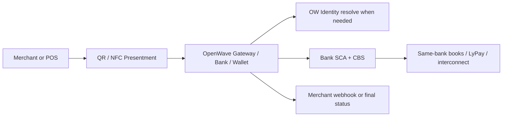
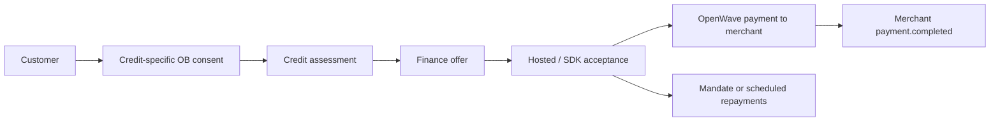

# Architecture & Infrastructure

This page covers the full OpenWave system topology — the participants, how they connect, and how money and data flow.

Presented payments fit into the same topology as a **channel layer**. QR and NFC never bypass hosted or bank-controlled authorization. They only change how the payment or mandate session is initiated.

Credit & Finance fits as a **finance lifecycle layer**. It consumes customer-permissioned Open Banking data, creates assessment and offer records, then reuses the normal Payments and mandate rails for merchant settlement and customer repayment.

## Where presented payments fit



The key architectural rule is that the **presentment layer stays thin**:

- it starts the flow
- it does not replace authorization
- it does not replace settlement
- it does not replace identity resolution

---

## Where Credit & Finance fits



Credit & Finance is not a new settlement rail and not a credit bureau. It standardizes how a finance provider requests consented inputs, returns safe assessment output, creates offers, records acceptance, and publishes repayment schedules.

---

## System Overview

<section class="ow-architecture-motion ow-architecture-motion-doc" aria-label="Animated OpenWave architecture overview">
  <div class="ow-motion-copy">
    <p class="ow-eyebrow">Live topology</p>
    <h2>OpenWave separates identity, gateway routing, customer consent, bank SCA, finance lifecycle, and settlement.</h2>
    <p>The gateway coordinates. The bank authenticates and moves money. Identity resolves NPT handles. Finance providers make provider-owned decisions from consented data. Settlement completes through same-bank books or national rails.</p>
  </div>
  <div class="ow-network-graphic" aria-hidden="true">
    <svg viewBox="0 0 920 520" role="img">
      <g class="ow-lines">
        <path class="ow-flow ow-flow-a" d="M160 155 C290 105 330 105 460 155"></path>
        <path class="ow-flow ow-flow-b" d="M160 365 C290 415 330 415 460 365"></path>
        <path class="ow-flow ow-flow-c" d="M460 155 C595 105 635 105 760 155"></path>
        <path class="ow-flow ow-flow-d" d="M460 365 C595 415 635 415 760 365"></path>
        <path class="ow-flow ow-flow-e" d="M460 260 C560 260 645 260 760 260"></path>
      </g>
      <g class="ow-node" transform="translate(64 116)"><rect width="192" height="78" rx="20"></rect><text x="96" y="34">Merchant</text><text class="ow-node-sub" x="96" y="56">API + webhooks</text></g>
      <g class="ow-node" transform="translate(64 326)"><rect width="192" height="78" rx="20"></rect><text x="96" y="34">TPP</text><text class="ow-node-sub" x="96" y="56">scoped consent</text></g>
      <g class="ow-node ow-node-gateway" transform="translate(328 205)"><rect width="264" height="110" rx="28"></rect><text x="132" y="45">Gateway</text><text class="ow-node-sub" x="132" y="72">route + orchestrate</text></g>
      <g class="ow-node" transform="translate(664 116)"><rect width="192" height="78" rx="20"></rect><text x="96" y="34">Bank</text><text class="ow-node-sub" x="96" y="56">SCA + CBS</text></g>
      <g class="ow-node" transform="translate(664 221)"><rect width="192" height="78" rx="20"></rect><text x="96" y="34">Identity</text><text class="ow-node-sub" x="96" y="56">NPT source</text></g>
      <g class="ow-node" transform="translate(664 326)"><rect width="192" height="78" rx="20"></rect><text x="96" y="34">Settlement</text><text class="ow-node-sub" x="96" y="56">books / rail</text></g>
      <circle class="ow-packet ow-packet-a" r="7"></circle>
      <circle class="ow-packet ow-packet-b" r="7"></circle>
      <circle class="ow-packet ow-packet-c" r="7"></circle>
    </svg>
  </div>
</section>

<section class="ow-architecture-board ow-doc-demo" aria-label="Animated OpenWave request classes">
  <div class="ow-suite-head">
    <p class="ow-eyebrow">Data-flow layers</p>
    <h2>Each arrow carries one class of trust, never everything at once.</h2>
    <p>Merchants create intent, customers authorize in hosted surfaces, identity resolves routing metadata, banks verify and execute, and webhooks close the merchant loop.</p>
  </div>
  <div class="ow-system-map" aria-hidden="true">
    <div class="ow-map-node ow-map-merchant"><b>Merchant</b><small>intent + fulfilment</small></div>
    <div class="ow-map-node ow-map-customer"><b>Hosted UI</b><small>customer decision</small></div>
    <div class="ow-map-node ow-map-gateway"><b>Gateway</b><small>route + enforce</small></div>
    <div class="ow-map-node ow-map-identity"><b>Identity</b><small>alias metadata</small></div>
    <div class="ow-map-node ow-map-bank"><b>Bank</b><small>SCA + CBS</small></div>
    <div class="ow-map-node ow-map-rail"><b>Rails</b><small>books / LyPay / GIP</small></div>
    <span class="ow-data-line ow-data-session"><i></i><em>POST session</em></span>
    <span class="ow-data-line ow-data-auth"><i></i><em>auth token</em></span>
    <span class="ow-data-line ow-data-id"><i></i><em>resolve</em></span>
    <span class="ow-data-line ow-data-bank"><i></i><em>callback</em></span>
    <span class="ow-data-line ow-data-settle"><i></i><em>movement</em></span>
    <span class="ow-data-line ow-data-webhook"><i></i><em>signed event</em></span>
  </div>
</section>

```
╔═══════════════════════════════════════════════════════════════════════════════╗
║                         OPENWAVE ECOSYSTEM                                    ║
╠══════════════╦═══════════════════════════╦══════════════════════════════════╣
║  MERCHANTS   ║    OPENWAVE GATEWAY        ║  BANKS & CUSTOMERS               ║
║              ║                           ║                                  ║
║  E-commerce  ║  ┌─────────────────────┐  ║  Bank A CBS ◄─── Bank A App      ║
║  POS         ║  │  Payment Engine     │  ║                                  ║
║  Billing     ║  │  Alias Registry     │◄─╫──Bank B CBS ◄─── Bank B App      ║
║  Apps        ║  │  Open Banking       │  ║                                  ║
║              ║  │  Webhook Dispatcher │  ║  Bank C CBS ◄─── Bank C App      ║
║  ──────────► ║  │  Settlement Engine  │  ║                                  ║
║  REST API    ║  └──────────┬──────────┘  ║  (any number of banks)           ║
║  + Webhooks  ║             │             ║                                  ║
╚══════════════╬═════════════╪═════════════╬══════════════════════════════════╝
               ║    CBL NATIONAL INFRASTRUCTURE                                ║
               ╠═════════════╪═════════════╗                                  ║
               ║    NAD       │    LyPay    ║                                  ║
               ║   (Alias)    │  (Transfer) ║                                  ║
               ╚═════════════╧═════════════╝                                  ║
```

---

## Participant Roles

### Merchants
Merchants integrate the gateway **once** and accept payments from customers at any participating bank.

- Authenticate with a **merchant API key** (`Authorization: Bearer <key>`)
- Create payment sessions via `POST /payments/initiate`
- Receive outcomes via **signed webhooks** (`X-OpenWave-Signature`)
- Never talk to banks directly — the gateway handles all bank routing

### Banks
Banks expose a **standardised callback interface** to the gateway. The gateway calls the bank's core banking system (CBS) to verify identities, trigger debits, and receive credits.

- Authenticate inbound gateway calls with a **bank API key** (`X-OpenWave-Bank-Key`)
- Implement endpoints: `resolve-alias`, `send-otp`, `verify-otp`, `send-push`, `execute-transaction`, `refund-transaction`, `notify-credit`
- Enroll in **CBL NAD** so customers can receive payments by alias
- Connect to **CBL LyPay** for cross-bank outbound transfers and inbound credit callbacks

### Customers
Customers authenticate using their bank's existing credentials (OTP or push notification). They never create a separate gateway account.

### Third-Party Providers (TPPs)
Fintechs and apps that use **Open Banking** to read account data or initiate payments on behalf of customers, under explicit OAuth 2.0 + PKCE consent.

### Finance Providers
Banks, fintechs, or regulated lenders that use customer-approved Open Banking data to assess affordability, create BNPL or revolving offers, disclose Murabaha terms, and service repayment schedules. OpenWave standardizes the lifecycle; the provider owns the credit policy, model, regulatory responsibility, and customer contract.

### Gateway Operators
Any entity running a compliant OpenWave gateway instance. Operators register banks and merchants, configure settlement strategies, and maintain the CBL connections.

---

## Component Architecture

```
┌────────────────────────────── OpenWave Gateway ─────────────────────────────┐
│                                                                               │
│  ┌─────────────────┐  ┌──────────────────┐  ┌────────────────────────────┐  │
│  │ Payment Session │  │  Alias Registry  │  │   Open Banking Engine      │  │
│  │ Service         │  │  Service         │  │                            │  │
│  │                 │  │                  │  │  Consent → AISP/PISP       │  │
│  │ initiate()      │  │  register()      │  │  OAuth 2.0 + PKCE          │  │
│  │ resolvePayer()  │  │  resolve()       │  │  SCA challenge             │  │
│  │ selectAuth()    │  │  deactivate()    │  └────────────────────────────┘  │
│  │ confirm()       │  └──────────────────┘                                  │
│  │ confirmPush()   │                        ┌────────────────────────────┐  │
│  │ executeDeduct() │  ┌──────────────────┐  │  Webhook Dispatcher        │  │
│  └────────┬────────┘  │ Settlement       │  │                            │  │
│           │           │ Strategy Service │  │  payment.completed         │  │
│           │           │                  │  │  payment.settlement_pending│  │
│           │           │  SAME_BANK_OR_   │  │  payment.failed            │  │
│  ┌────────▼────────┐  │  LYPAY (default) │  │  mandate.activated         │  │
│  │ Bank Core       │  │                  │  │  settlement.completed      │  │
│  │ Client Factory  │  │  resolve_route() │  │                            │  │
│  │                 │  └──────────────────┘  │  HMAC-SHA256 signature     │  │
│  │ Generic HTTP    │                        │  Retry with backoff        │  │
│  │ Forwarder       │  ┌──────────────────┐  └────────────────────────────┘  │
│  │ (routes to any  │  │  Bank Routing    │                                  │
│  │  bank via       │  │  Service         │  ┌────────────────────────────┐  │
│  │  coreBaseUrl)   │  │                  │  │  Admin API                 │  │
│  └─────────────────┘  │                  │  │                            │  │
│                        │  IBAN → bank     │  │                            │  │
│                        │  alias → bank    │  │  Bank CRUD + key rotation  │  │
│                        │  handle lookup   │  │  Merchant CRUD             │  │
│                        └──────────────────┘  │  Settlement strategy config│  │
│                                               │  Webhook retry monitor    │  │
└───────────────────────────────────────────────┴────────────────────────────┘
```

---

## Payment Transaction Routing

The gateway resolves how to settle funds based on a configurable **settlement strategy**. The OpenWave standard defines two routing paths:

### SAME_BANK — Internal Book Transfer

```
Customer (Bank A)                  Bank A CBS                  Merchant (Bank A)
       │                                │                              │
       │── tap Pay ─────────────────────►│                              │
       │                                │                              │
       │                    executeTransaction(route=SAME_BANK)        │
       │                                │── debit + credit ───────────►│
       │                                │   (atomic book transfer)     │
       │                                │◄── confirmed ────────────────│
       │◄── payment.completed ──────────┤                              │
            (webhook)                  │
```

- **Used when:** debtor and merchant are at the same bank
- **Timing:** instant (< 1 second)
- `payment.completed` fires immediately

---

### LYPAY — Cross-Bank via CBL

```
Customer (Bank A)    Gateway       Bank A CBS      CBL LyPay     Bank B CBS    Merchant (Bank B)
       │               │               │               │               │               │
       │─OTP confirm──►│               │               │               │               │
       │               │──executeTransaction            │               │               │
       │               │   (route=LYPAY_INITIATE)──────►│               │               │
       │               │               │──LyPay send──►│               │               │
       │               │               │               │──credit───────►│               │
       │               │               │               │               │──credit───────►│
       │               │◄──credit callback(LyPay)──────────────────────│               │
       │               │                               │               │               │
       │◄──payment.settlement_pending (webhook)                                        │
       │◄──payment.completed (webhook, on credit confirm)                              │
```

- **Used when:** debtor and merchant are at different banks
- **Timing:** 2–10 seconds (CBL LyPay real-time rail)
- **Status flow:** auth confirmed → `SETTLEMENT_PENDING` → `COMPLETED`
- `payment.settlement_pending` fires when debit is confirmed + LyPay instruction submitted
- `payment.completed` fires when CBL confirms credit at the merchant's bank

---

## Payment Session State Machine

```
                      ┌─────────────────────────────────────────┐
                      │           Payment Session                │
                      └─────────────────────────────────────────┘

     [merchant calls POST /payments/initiate]
                      │
                      ▼
                  PENDING ──────────────────────────────────► EXPIRED
                      │              (TTL: 15 min)
     [customer resolves payer, gateway picks auth mode]
                      │
               ┌──────┴──────┐
               ▼             ▼
           OTP_SENT      PUSH_SENT
               │             │
               └──────┬──────┘
     [customer enters OTP / approves push]
                      │
                      ▼
           [executeTransaction called]
                      │
               ┌──────┴──────────────┐
               ▼                     ▼
           COMPLETED          SETTLEMENT_PENDING   ◄── LYPAY cross-bank only
           (SAME_BANK)             │
               │          [CBL LyPay credit callback]
               │                   │
               └──────┬────────────┘
                      ▼
                  COMPLETED ──────────────────────► FAILED
              (payment.completed)            (payment.failed)
```

---

## Checkout Session Flow (Step by Step)

The gateway is **not a bank**. It routes. The bank handles OTP generation, customer lookup, and debit execution internally. The gateway only passes IBANs — never CBS customer IDs.

```
Merchant (backend)
  │
  │  POST /api/v1/payments/initiate
  │  { amount, currency, description, destination }
  │
  ▼
Gateway → creates PaymentSession (status: PENDING) → returns { session_id, checkout_url }
  │
Customer (browser / mobile)
  │
  │  POST /api/v1/session/{session_id}/resolve-payer
  │  { payer_iban OR payer_alias }
  │
  ▼
Gateway → resolves bank via IBAN prefix / NAD alias → returns { bank_handle, auth_modes }
  │
  │  POST /api/v1/session/{session_id}/select-auth  { auth_mode: "OTP" }
  │
  ▼
Gateway → POST {bank.coreBaseUrl}/send-otp  { session_id, payer_iban }
  │        ↳ Bank looks up customer from IBAN internally
  │        ↳ Bank generates OTP, sends SMS/email to customer
  │        ↳ Bank returns { otp_token, phone_masked }
  ▼
Gateway → session status: OTP_SENT → returns { otp_token, phone_masked }
  │
  │  POST /api/v1/session/{session_id}/confirm-otp  { otp_code }
  │
  ▼
Gateway → POST {bank.coreBaseUrl}/verify-otp  { session_id, otp_token, otp_code }
  │        ↳ Bank verifies OTP → returns { verified: true }
  ▼
Gateway → POST {bank.coreBaseUrl}/execute-transaction  { session_id, debtor_iban,
  │        creditor_iban, amount, currency, route_type, ... }
  │        ↳ Bank debits payer account (CBS book transfer or LyPay initiation)
  │        ↳ Bank returns { transfer_ref, route_used }
  ▼
Gateway → session status: COMPLETED (or SETTLEMENT_PENDING for cross-bank LyPay)
        → fires webhook: payment.completed to merchant
```

### Key Invariants

| Rule | Enforcement |
|---|---|
| Gateway is bank-agnostic | One generic HTTP forwarder routes to any bank via `coreBaseUrl` |
| No bank names in gateway code | Bank selection is dynamic — `BankEntity.coreBaseUrl` drives routing |
| CBS customer IDs never leave the bank | Gateway only sends/receives IBANs |
| OTP content is a bank concern | Gateway sends `payer_iban`; bank enriches SMS/email internally |
| Merchant context in OTP notifications | Bank fetches from its own payment session record — not from gateway |

---

## CBL Infrastructure

OpenWave relies on two CBL-operated national systems for cross-bank payments:

### NAD — National Alias Directory

- Operated by: **Central Bank of Libya (CBL)**
- Purpose: Resolve any identifier (NPT alias, phone number, national ID) to a canonical **IBAN + institution code**
- Used by: gateway before any cross-bank LyPay instruction to identify the destination bank
- Banks enroll their customers via the NAD enrollment API

```
Gateway                              CBL NAD
   │                                    │
   │── resolve("mtellesy@andalus") ────►│
   │◄── { iban: "LY83002700...", bank: "andalus" }
```

### LyPay — National Interbank Transfer Rail

- Operated by: **Central Bank of Libya (CBL)**
- Purpose: Move funds from any Libyan bank to any other Libyan bank in real time
- Banks are assigned a **LyPay participant code** by CBL
- Supports: fund transfer initiation, credit callback (webhook to gateway), status query
- Debtor bank is the LyPay originator — not the gateway

```
Bank A (debtor)                       CBL LyPay                 Bank B (creditor)
      │                                    │                            │
      │── LyPay fund transfer ────────────►│                            │
      │   { from: LY83..., to: LY92...,   │                            │
      │     amount, lypay_participant }    │── credit notice ──────────►│
      │                                   │   (credits merchant IBAN)   │
      │                                   │◄── credit confirmed ────────│
      │                                   │── callback to gateway ──────────────►
```

---

## Deployment Topology

### Single-Operator (Centralised)

```
                    ┌──────────────────────────────┐
                    │     OpenWave Gateway          │
                    │     (operator implementation) │
                    │                              │
               ┌────┤  Spring Boot + MySQL + Redis │────┐
               │    └──────────────────────────────┘    │
               │                                        │
        ┌──────▼──────┐                         ┌──────▼──────┐
        │  Bank A CBS │                         │  Bank B CBS │
        │  (any bank) │                         │  (any bank) │
        └─────────────┘                         └─────────────┘
               │                                        │
               └────────────────────────────────────────┘
                                    │
                             CBL (NAD + LyPay)
```

All banks and merchants connect to **one shared gateway**. The gateway holds bank API keys, routes all payments, and dispatches webhooks.

---

### Multi-Operator (Federated)

```
  ┌─────────────────────┐          ┌──────────────────────┐
  │  Gateway A (Libya)   │◄────────►│  Gateway B (Regional) │
  │  Banks: Andalus, NUB │  OpenWave│  Banks: Bank X, Y    │
  │  Merchants: A, B, C  │  Standard│  Merchants: D, E     │
  └──────────┬──────────┘          └──────────────────────┘
             │
         CBL NAD + LyPay
```

Multiple independent gateways can **interoperate** because the standard defines the contract. A merchant on Gateway A can accept payments from a customer whose bank is connected to Gateway B — as long as both gateways implement OpenWave.

---

## Technology Reference

| Layer | Technology |
|---|---|
| **Gateway Runtime** | Spring Boot 3, Kotlin, JPA/Hibernate |
| **Database** | MySQL 8 (payment sessions, banks, merchants, aliases) |
| **Cache / Jobs** | Redis (session cache, webhook retry queue) |
| **Bank Comms** | HTTP (WebClient) — single generic forwarder to each bank's `coreBaseUrl` |
| **CBL Comms** | LyPay REST API, NAD REST API |
| **Webhooks** | HTTPS POST + HMAC-SHA256 signature, exponential backoff |
| **Auth (Merchant)** | `Authorization: Bearer <api_key>` |
| **Auth (Bank)** | `X-OpenWave-Bank-Key: <key>` |
| **Auth (Admin)** | `X-OpenWave-Admin-Key: <key>` |
| **Spec Format** | OpenAPI 3.0.3 YAML |

---

## Security Model

| Concern | Mechanism |
|---|---|
| Merchant API keys | Bcrypt-hashed in DB, bearer token on every request |
| Bank API keys | Rotatable, scoped per bank |
| Webhook authenticity | HMAC-SHA256 over raw body with per-merchant secret |
| Session tokens | Short-lived (15 min TTL), scoped to one payment session |
| OTP delivery | Via bank CBS (not gateway) — gateway never sees OTPs |
| Push auth | Bank-side push notification — gateway only polls confirmation |
| Admin access | Separate admin key; never exposed in OpenWave standard |

---

## How to Implement

→ [Merchant Integration Guide](./merchants.md)  
→ [Bank Integration Guide](./banks.md)  
→ [TPP / Open Banking Guide](./tpp.md)  
→ [Gateway Operators Guide](./operators.md)  
→ [Settlement & CBL Infrastructure](./settlement.md)  
→ [Downloads — Spec files, Postman, code gen](../downloads.md)
