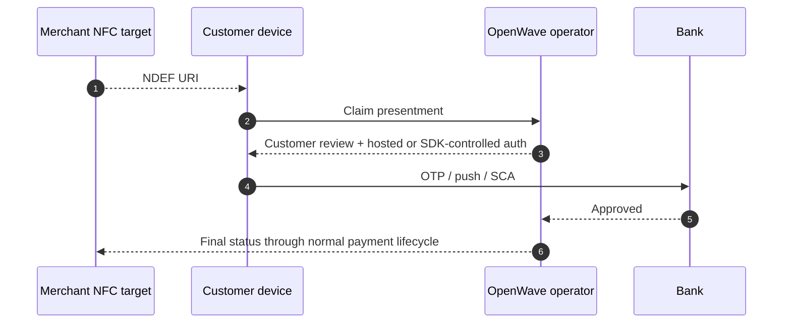

# NFC Handoff

OpenWave NFC uses the same conceptual model as QR: NFC starts a presentment claim, then hands the customer into a secure authorization flow.

## Why NFC exists in the standard

NFC gives the same trust model as QR but with a different user experience:

- no camera required
- better fit for in-person acceptance
- better fit for bank app or wallet tap flows

## v1 model

- Recommended payload: NFC Forum `NDEF_URI`
- URI value: HTTPS universal/app link that resolves to the presentment, with `openwave://` allowed as a fallback only when the accepting app owns the scheme
- Target uses: merchant-presented handoff only in v1
- The claim response must provide a customer review summary and then open or return a hosted checkout URL, secure SDK sheet, wallet handoff, or bank-app handoff session before any authorization or completion state

## Example NDEF payload

```json
{
  "format": "NDEF_URI",
  "ndef_record_type": "URI",
  "value": "https://pay.openwave.ly/openwave/presentments/prs_01J15B6A1N2QZ5YP4V4P4FJW40?token=claim-token&channel=NFC&intent=ONE_TIME_PAYMENT&operator=andalus-direct"
}
```

## Platform behavior

| Platform | v1 support model |
|---|---|
| Android | App reads NDEF URI with Android NFC APIs or opens an Android App Link, then claims the presentment and shows secure authorization. |
| iOS | Background tag reading or Core NFC opens a universal link / app-controlled NFC read, then claims the presentment and shows secure authorization. |
| POS / merchant device | Reads NDEF URI, resolves presentment, and waits for final OpenWave status; the POS must not collect bank credentials or OTP. |

True contactless card-kernel behavior through secure-element or HCE rails is not required for OpenWave Presented Payments v1. It can be added later as a platform-specific extension, but the interoperable v1 contract is NDEF URI plus OpenWave claim.

## Security expectations

- NFC tap alone is not payment authorization
- NFC is only a channel layer over the normal OpenWave payment or mandate lifecycle
- Replay protection still applies
- Device-local OTP, PIN, passcode, push approval, or bank credential collection outside the secure bank, hosted, or SDK-controlled surface is out of scope
- Production deployments should bind NFC-presented flows to device and session telemetry where available
- The customer must see merchant, amount, funding account, expiry, fees if any, and recurring terms where relevant before approval

## Typical handoff sequence



## Typical NFC uses

| Use case | Pattern |
|---|---|
| Merchant countertop tap | `MERCHANT_PRESENTED` + `ONE_TIME_PAYMENT` |
| Subscription kiosk signup | `MERCHANT_PRESENTED` + `MANDATE_APPROVAL` |
| Merchant app handoff | `MERCHANT_PRESENTED` + `ONE_TIME_PAYMENT` with optional app/wallet handoff |

## Bank interoperability rule

If banks claim NFC support, they should all:

- accept the same OpenWave URI model
- publish capability flags honestly
- keep customer approval inside a trusted bank-controlled surface
- show the customer review summary before approval
- map the result back into normal OpenWave payment or mandate statuses
