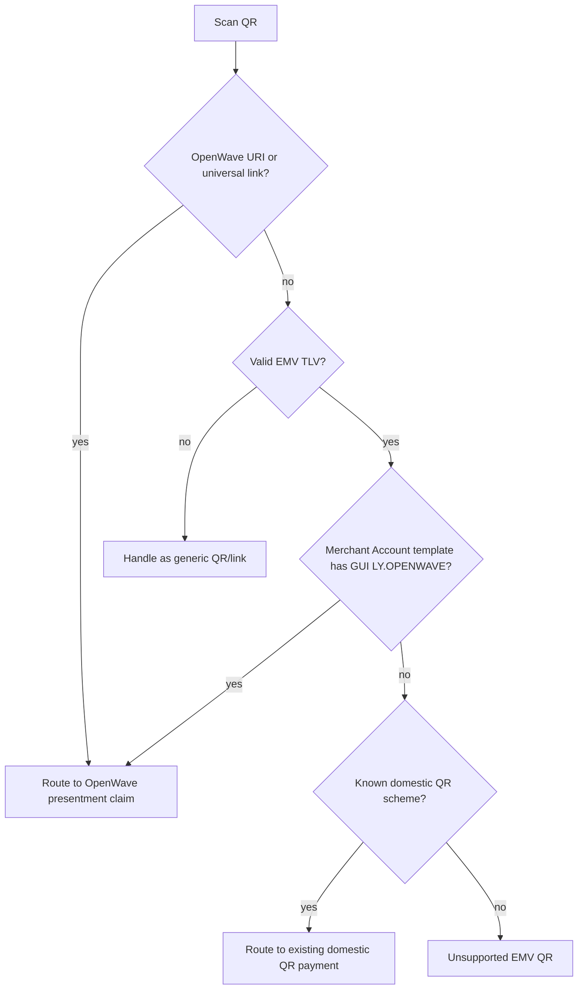

# QR Payloads

OpenWave QR payloads use an **EMVCo-compatible QR profile** with an OpenWave merchant-account template. The QR carries a signed/tokenized presentment reference, not bank secrets and not raw authorization data.

## QR design goal

The QR must be portable across operators and easy for banks or wallets to understand, while still forcing the real authorization to happen later in a secure surface.

## Payload rules

- Must identify the presentment
- Must identify the operator or issuer
- Must carry expiry
- Must be replay-protected
- Must indicate whether the amount is fixed or open
- Must indicate whether the flow is `ONE_TIME_PAYMENT` or `MANDATE_APPROVAL`
- Must resolve to a customer review summary before approval

## EMV QR profile

OpenWave QR is a channel profile inside the normal EMV QR TLV structure. This lets an existing bank scanner parse one QR payload and decide whether to continue through the current domestic QR flow or through OpenWave.

Recommended merchant account information template:

| EMV tag | Meaning |
|---|---|
| `00` | Payload format indicator, normally `01` |
| `01` | Point of initiation method, `11` dynamic/open amount or `12` fixed amount |
| `26` | Recommended OpenWave Merchant Account Information template |
| `50` | Optional OpenWave operator template |
| `52` | Merchant category code |
| `53` | ISO 4217 numeric currency, for example `434` for LYD |
| `54` | Transaction amount when fixed |
| `58` | Country code |
| `59` | Merchant display name |
| `60` | Merchant city |
| `62` | Additional data such as merchant reference |
| `63` | CRC16/CCITT-FALSE checksum |

OpenWave template inside tag `26`:

| Sub-tag | Value |
|---|---|
| `00` | `LY.OPENWAVE` |
| `01` | `presentment_id` |
| `02` | short-lived claim token or signed reference |
| `03` | compact channel code, normally `QR` |
| `04` | compact intent code, `P` for one-time payment or `M` for mandate approval |

Operator or gateway id should be carried in the optional OpenWave operator template tag `50`, or resolved from the presentment directory. Do not use NUMO `62-*` sub-tags for OpenWave routing metadata because NUMO already defines those for bill/reference/terminal-purpose data.

OpenWave operator template inside tag `50`:

| Sub-tag | Value |
|---|---|
| `00` | `LY.OPENWAVE.OP` |
| `01` | operator or gateway id |

If a deployment already uses tag `26`, it may use another unused EMV Merchant Account Information tag from `26` to `51`. The scanner must look for the `LY.OPENWAVE` GUI inside those templates before routing to OpenWave.

## Scanner routing



## Recommended payload fields

| Field | Why it exists |
|---|---|
| `presentment_id` or signed reference | Uniquely identifies the presentment |
| `operator_id` | Tells the scanner where the presentment belongs |
| `intent` | Distinguishes one-time payment from mandate approval |
| `mode` | Fixed to `MERCHANT_PRESENTED` in v1 |
| `amount_mode` | Tells the scanner whether amount is fixed or open |
| `expires_at` | Prevents stale QR reuse |
| `sig` | Protects integrity and replay safety |

## Example merchant-presented QR object

```json
{
  "format": "EMV_QR",
  "value": "00020101021226890011LY.OPENWAVE0136prs_01J15B6A1N2QZ5YP4V4P4FJW400222short-lived-claim-code0302QR0401P50310014LY.OPENWAVE.OP0114andalus-direct5204000053034345406860.0005802LY5909OpenWave6007Tripoli6304A1B2",
  "emv_profile": {
    "merchant_account_information_tag": "26",
    "gui": "LY.OPENWAVE"
  },
  "intent": "ONE_TIME_PAYMENT",
  "mode": "MERCHANT_PRESENTED",
  "amount_mode": "FIXED",
  "amount": 860000,
  "currency": "LYD",
  "expires_at": "2026-05-15T19:30:00Z"
}
```

## Example recurring mandate approval QR object

```json
{
  "format": "EMV_QR",
  "value": "00020101021226730011LY.OPENWAVE0120prs_01J15MANDATE94T70222short-lived-claim-code0302QR0401M50310014LY.OPENWAVE.OP0114andalus-direct520400005303434540610.0005802LY5909OpenWave6007Tripoli6304F00D",
  "intent": "MANDATE_APPROVAL",
  "mode": "MERCHANT_PRESENTED",
  "amount_mode": "FIXED",
  "amount": 10000,
  "currency": "LYD",
  "recurrence": {
    "frequency": "MONTHLY",
    "end_date": "2027-05-15"
  },
  "expires_at": "2026-05-15T19:30:00Z"
}
```

## Merchant-presented QR

Merchant-presented QR is appropriate for:

- online bill pages
- in-store screens
- printed invoices
- subscription signup flows that lead into hosted mandate approval

## App and platform wallet handoff

Some quick flows start from an app, universal link, Android app link, iOS app link, or platform wallet handoff instead of a camera QR scan. These flows should still use the same OpenWave presentment contract:

- the handoff carries a signed OpenWave URI or tokenized presentment reference
- the claim endpoint returns a secure authorization surface
- the customer review summary is shown before approval
- final payment or mandate status follows the normal OpenWave lifecycle

This allows banks, wallets, and gateways to support platform-specific user experiences without fragmenting the payment standard.

## Interoperability note

The QR payload format is EMV-compatible and OpenWave-routable. Gateways, banks, and wallets can all implement it directly as long as they honor capability discovery, the `LY.OPENWAVE` template, and security requirements. Existing domestic QR schemes should keep their identifiers and continue to route normally.

## Validation checklist for scanners

1. Parse URI/universal-link payloads first.
2. If the payload is EMV TLV, validate structure and CRC where available.
3. Search EMV Merchant Account Information tags `26` to `51` for GUI `LY.OPENWAVE`.
4. Check expiry and operator/issuer trust by resolving the presentment.
5. Refuse presentments that require unsupported modes or intents.
6. Claim the presentment over the network before showing success to the customer.
7. Show the customer review summary.
8. Open the claim-returned hosted URL, SDK sheet, wallet handoff, or bank-app handoff before any authorization or completion state.

## Security notes

- A QR code must never embed customer OTP, PIN, passcode, push approval result, bank credentials, or approval proof.
- Operators should sign or tokenize the payload so tampering is detectable.
- Printed or cached QR codes should expire quickly when tied to a fixed amount.
- QR is only a channel layer. After claim, authorization still happens through the normal OpenWave payment or mandate lifecycle.
